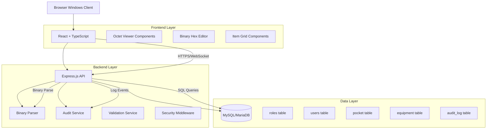
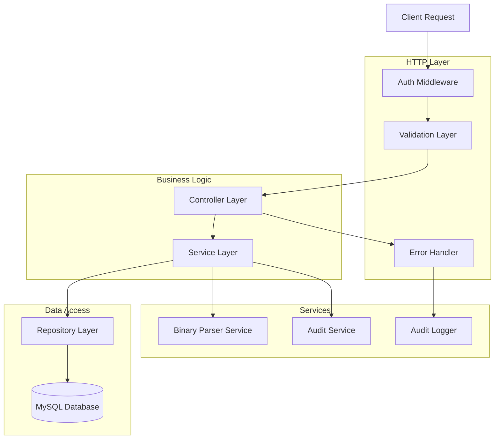

## 1. Arquitetura do Sistema



## 2. Descrição das Tecnologias

- **Frontend**: React@18 + TypeScript + Vite + TailwindCSS
- **Initialization Tool**: vite-init
- **Backend**: Node.js@18 + Express.js + TypeScript
- **Database**: MySQL@8.0 / MariaDB@10.6
- **Binary Parsing**: Node.js Buffer + Custom Binary Parser
- **Authentication**: JWT com refresh tokens
- **Real-time**: WebSocket para notificações
- **Security**: bcrypt, helmet, rate-limiting, input validation

## 3. Definições de Rotas

| Rota | Propósito |
|------|-----------|
| / | Dashboard principal com estatísticas |
| /login | Página de autenticação do GM |
| /characters | Busca e listagem de personagens |
| /character/:id | Editor completo do personagem |
| /character/:id/inventory | Editor de inventário (pocket) |
| /character/:id/equipment | Editor de equipamentos |
| /character/:id/warehouse | Editor de warehouse (store/dress/material/card) |
| /character/:id/octets | Editor de dados binários |
| /items/send | Envio de itens por correio |
| /items/send/bulk | Envio em massa de itens |
| /audit | Visualização de logs de auditoria |
| /export | Exportação de dados de personagens |
| /api/auth/* | Endpoints de autenticação |
| /api/characters/* | CRUD de personagens |
| /api/octets/* | Parse e edição de octets |
| /api/audit/* | Logs e relatórios |

## 4. Definições de APIs

### 4.1 Autenticação

```
POST /api/auth/login
```

Request:
| Parâmetro | Tipo | Obrigatório | Descrição |
|-----------|------|-------------|-----------|
| username | string | sim | Nome de usuário do GM |
| password | string | sim | Senha (será hasheada) |
| ip_address | string | sim | IP do cliente para segurança |

Response:
| Parâmetro | Tipo | Descrição |
|-----------|------|-----------|
| token | string | JWT token para autenticação |
| refresh_token | string | Token para renovação |
| user | object | Dados do usuário logado |
| permissions | array | Lista de permissões do GM |

Exemplo:
```json
{
  "username": "gm_admin",
  "password": "senha_secreta_123",
  "ip_address": "192.168.1.100"
}
```

### 4.2 Personagens

```
GET /api/characters/search
```

Request Query Parameters:
| Parâmetro | Tipo | Obrigatório | Descrição |
|-----------|------|-------------|-----------|
| query | string | sim | Nome ou ID do personagem |
| search_type | string | não | 'name', 'id', 'account' |
| limit | number | não | Limite de resultados (max 50) |

```
PUT /api/characters/:id/base
```

Request Body:
| Parâmetro | Tipo | Obrigatório | Descrição |
|-----------|------|-------------|-----------|
| name | string | não | Novo nome do personagem |
| level | number | não | Novo nível (1-150) |
| exp | number | não | Nova experiência |
| sp | number | não | Skill points |
| reason | string | sim | Justificativa para auditoria |

### 4.3 Octets Binários

```
GET /api/octets/:characterId/:type
```

Response:
| Parâmetro | Tipo | Descrição |
|-----------|------|-----------|
| type | string | 'armor', 'weapon', 'skills' |
| binary_data | string | Dados hexadecimais do octet |
| parsed_data | object | Dados parseados em estrutura |
| size | number | Tamanho em bytes |

```
PUT /api/octets/:characterId/:type
```

Request Body:
| Parâmetro | Tipo | Obrigatório | Descrição |
|-----------|------|-------------|-----------|
| binary_data | string | sim | Novos dados hexadecimais |
| validation_hash | string | sim | Hash de validação |
| reason | string | sim | Motivo da alteração |

### 4.4 Itens e Inventário

```
POST /api/items/send
```

Request Body:
| Parâmetro | Tipo | Obrigatório | Descrição |
|-----------|------|-------------|-----------|
| target_character | string | sim | Nome do personagem destino |
| item_id | number | sim | ID do item no banco |
| quantity | number | sim | Quantidade (1-9999) |
| expire_hours | number | não | Horas até expirar |
| mail_message | string | não | Mensagem no correio |

## 5. Arquitetura do Servidor



## 6. Modelo de Dados

### 6.1 Estrutura do Banco de Dados

```mermaid
erDiagram
    roles ||--o{ users : contains
    users ||--o{ roles : has_role
    users ||--o{ characters : owns
    characters ||--o{ pocket : has_inventory
    characters ||--o{ equipment : has_equipment
    characters ||--o{ storehouse : has_storage
    characters ||--o{ task_data : has_tasks
    users ||--o{ audit_log : generates

    roles {
        int id PK
        string name
        string permissions
        int level
    }

    users {
        int id PK
        string username
        string password_hash
        string email
        int role_id FK
        datetime created_at
        datetime last_login
        string last_ip
        boolean is_active
    }

    characters {
        int id PK
        int user_id FK
        string name
        int race
        int class
        int gender
        int level
        int level2
        bigint exp
        int sp
        int hp
        int mp
        float pos_x
        float pos_y
        float pos_z
        int worldtag
        int reputation
        int pk
        binary property_octets
        binary var_data
        binary skills_octets
        binary meridian_data
        binary realm_data
        binary reincarnation_data
        datetime created_at
        datetime last_save
        boolean is_deleted
    }

    pocket {
        int id PK
        int character_id FK
        int capacity
        int money
        int item_count
        binary items_data
        datetime last_update
    }

    equipment {
        int id PK
        int character_id FK
        int slot_id
        int item_id
        int position
        int count
        int max_count
        binary data_octets
        datetime expire_date
        bigint guid1
        bigint guid2
        int mask
    }

    storehouse {
        int id PK
        int character_id FK
        string store_type
        int capacity
        int money
        binary store_data
        datetime last_update
    }

    audit_log {
        int id PK
        int user_id FK
        string action_type
        string table_name
        int record_id
        string field_name
        text old_value
        text new_value
        string reason
        string ip_address
        datetime created_at
        string user_agent
    }
```

### 6.2 Linguagem de Definição de Dados (DDL)

```sql
-- Tabela de usuários e permissões
CREATE TABLE roles (
    id INT PRIMARY KEY AUTO_INCREMENT,
    name VARCHAR(50) NOT NULL UNIQUE,
    permissions TEXT NOT NULL,
    level INT NOT NULL DEFAULT 1,
    created_at TIMESTAMP DEFAULT CURRENT_TIMESTAMP
);

CREATE TABLE users (
    id INT PRIMARY KEY AUTO_INCREMENT,
    username VARCHAR(50) NOT NULL UNIQUE,
    password_hash VARCHAR(255) NOT NULL,
    email VARCHAR(100) UNIQUE,
    role_id INT,
    created_at TIMESTAMP DEFAULT CURRENT_TIMESTAMP,
    last_login TIMESTAMP NULL,
    last_ip VARCHAR(45),
    is_active BOOLEAN DEFAULT TRUE,
    FOREIGN KEY (role_id) REFERENCES roles(id)
);

-- Tabela principal de personagens
CREATE TABLE characters (
    id INT PRIMARY KEY AUTO_INCREMENT,
    user_id INT NOT NULL,
    name VARCHAR(32) NOT NULL UNIQUE,
    race TINYINT NOT NULL DEFAULT 0,
    class TINYINT NOT NULL DEFAULT 0,
    gender TINYINT NOT NULL DEFAULT 0,
    level INT NOT NULL DEFAULT 1,
    level2 INT NOT NULL DEFAULT 0,
    exp BIGINT NOT NULL DEFAULT 0,
    sp INT NOT NULL DEFAULT 0,
    hp INT NOT NULL DEFAULT 50,
    mp INT NOT NULL DEFAULT 50,
    pos_x FLOAT NOT NULL DEFAULT 0,
    pos_y FLOAT NOT NULL DEFAULT 0,
    pos_z FLOAT NOT NULL DEFAULT 0,
    worldtag INT NOT NULL DEFAULT 1,
    reputation INT NOT NULL DEFAULT 0,
    pk INT NOT NULL DEFAULT 0,
    property_octets BLOB,
    var_data BLOB,
    skills_octets BLOB,
    meridian_data BLOB,
    realm_data BLOB,
    reincarnation_data BLOB,
    created_at TIMESTAMP DEFAULT CURRENT_TIMESTAMP,
    last_save TIMESTAMP DEFAULT CURRENT_TIMESTAMP ON UPDATE CURRENT_TIMESTAMP,
    is_deleted BOOLEAN DEFAULT FALSE,
    FOREIGN KEY (user_id) REFERENCES users(id),
    INDEX idx_name (name),
    INDEX idx_user_id (user_id)
);

-- Tabela de inventário (pocket)
CREATE TABLE pocket (
    id INT PRIMARY KEY AUTO_INCREMENT,
    character_id INT NOT NULL,
    capacity INT NOT NULL DEFAULT 32,
    money INT NOT NULL DEFAULT 0,
    item_count INT NOT NULL DEFAULT 0,
    items_data BLOB,
    last_update TIMESTAMP DEFAULT CURRENT_TIMESTAMP ON UPDATE CURRENT_TIMESTAMP,
    FOREIGN KEY (character_id) REFERENCES characters(id) ON DELETE CASCADE,
    UNIQUE KEY uk_character_pocket (character_id)
);

-- Tabela de equipamentos
CREATE TABLE equipment (
    id INT PRIMARY KEY AUTO_INCREMENT,
    character_id INT NOT NULL,
    slot_id TINYINT NOT NULL,
    item_id INT NOT NULL,
    position INT NOT NULL,
    count INT NOT NULL DEFAULT 1,
    max_count INT NOT NULL DEFAULT 1,
    data_octets BLOB,
    expire_date TIMESTAMP NULL,
    guid1 BIGINT DEFAULT 0,
    guid2 BIGINT DEFAULT 0,
    mask INT DEFAULT 0,
    FOREIGN KEY (character_id) REFERENCES characters(id) ON DELETE CASCADE,
    UNIQUE KEY uk_character_slot (character_id, slot_id),
    INDEX idx_character (character_id)
);

-- Tabela de warehouse (armazém)
CREATE TABLE storehouse (
    id INT PRIMARY KEY AUTO_INCREMENT,
    character_id INT NOT NULL,
    store_type ENUM('store', 'dress', 'material', 'card') NOT NULL,
    capacity INT NOT NULL,
    money INT NOT NULL DEFAULT 0,
    store_data BLOB,
    last_update TIMESTAMP DEFAULT CURRENT_TIMESTAMP ON UPDATE CURRENT_TIMESTAMP,
    FOREIGN KEY (character_id) REFERENCES characters(id) ON DELETE CASCADE,
    UNIQUE KEY uk_character_store_type (character_id, store_type)
);

-- Tabela de auditoria crítica
CREATE TABLE audit_log (
    id INT PRIMARY KEY AUTO_INCREMENT,
    user_id INT NOT NULL,
    action_type VARCHAR(50) NOT NULL,
    table_name VARCHAR(64) NOT NULL,
    record_id INT NOT NULL,
    field_name VARCHAR(64),
    old_value TEXT,
    new_value TEXT,
    reason TEXT,
    ip_address VARCHAR(45) NOT NULL,
    user_agent VARCHAR(255),
    created_at TIMESTAMP DEFAULT CURRENT_TIMESTAMP,
    FOREIGN KEY (user_id) REFERENCES users(id),
    INDEX idx_user_action (user_id, action_type),
    INDEX idx_table_record (table_name, record_id),
    INDEX idx_created_at (created_at)
);

-- Inserir papéis padrão
INSERT INTO roles (name, permissions, level) VALUES
('viewer', 'read:characters,read:audit', 1),
('gm', 'read:characters,write:characters,read:audit,write:items', 2),
('super_admin', 'read:characters,write:characters,read:audit,write:items,manage:users,manage:system', 3);

-- Criar usuário admin padrão (senha: admin123)
INSERT INTO users (username, password_hash, email, role_id) VALUES
('admin', '$2b$10$92IXUNpkjO0rOQ5byMi.Ye4oKoEa3Ro9llC/.og/at2.uheWG/igi', 'admin@pwadmin.local', 3);
```

### 6.3 Índices e Performance

```sql
-- Índices para performance
CREATE INDEX idx_characters_level ON characters(level);
CREATE INDEX idx_characters_class ON characters(class);
CREATE INDEX idx_characters_created ON characters(created_at);
CREATE INDEX idx_audit_created ON audit_log(created_at DESC);
CREATE INDEX idx_audit_user ON audit_log(user_id, created_at DESC);

-- Procedimento para backup automático
DELIMITER //
CREATE PROCEDURE backup_character(IN char_id INT)
BEGIN
    DECLARE backup_id INT;
    
    -- Criar backup na tabela de histórico
    INSERT INTO character_history 
    SELECT NULL, c.*, NOW() 
    FROM characters c 
    WHERE c.id = char_id;
    
    -- Retornar ID do backup
    SELECT LAST_INSERT_ID() as backup_id;
END//
DELIMITER ;
```

## 7. Estratégia de Octets Binários

### 7.1 Parser de Octets

```typescript
// Interface para estrutura binária
interface OctetParser {
  parse(buffer: Buffer): ParsedData;
  serialize(data: ParsedData): Buffer;
  validate(buffer: Buffer): boolean;
  getSize(): number;
}

// Implementação para Armor Octets
class ArmorOctetParser implements OctetParser {
  parse(buffer: Buffer): ArmorData {
    if (buffer.length !== 64) {
      throw new Error('Invalid armor octet size');
    }
    
    return {
      refineLevel: buffer.readUInt8(0),
      durability: buffer.readUInt16LE(1),
      maxDurability: buffer.readUInt16LE(3),
      sockets: [
        buffer.readUInt32LE(5),
        buffer.readUInt32LE(9),
        buffer.readUInt32LE(13),
        buffer.readUInt32LE(17)
      ],
      addons: this.parseAddons(buffer.slice(21, 61)),
      flags: buffer.readUInt32LE(61)
    };
  }
  
  serialize(data: ArmorData): Buffer {
    const buffer = Buffer.alloc(64);
    buffer.writeUInt8(data.refineLevel, 0);
    buffer.writeUInt16LE(data.durability, 1);
    buffer.writeUInt16LE(data.maxDurability, 3);
    
    data.sockets.forEach((socket, i) => {
      buffer.writeUInt32LE(socket, 5 + (i * 4));
    });
    
    this.serializeAddons(buffer, data.addons, 21);
    buffer.writeUInt32LE(data.flags, 61);
    
    return buffer;
  }
}
```

### 7.2 Validação de Integridade

```typescript
class OctetValidator {
  static validateArmorOctet(buffer: Buffer): ValidationResult {
    const errors: string[] = [];
    
    if (buffer.length !== 64) {
      errors.push(`Tamanho inválido: ${buffer.length}, esperado: 64`);
    }
    
    const refineLevel = buffer.readUInt8(0);
    if (refineLevel > 12) {
      errors.push(`Nível de refino inválido: ${refineLevel}`);
    }
    
    const durability = buffer.readUInt16LE(1);
    const maxDurability = buffer.readUInt16LE(3);
    if (durability > maxDurability) {
      errors.push(`Durabilidade atual maior que máxima: ${durability} > ${maxDurability}`);
    }
    
    return {
      isValid: errors.length === 0,
      errors
    };
  }
}
```

## 8. Plano MVP

### Fase 1 - Core Básico (2 semanas)
- Sistema de autenticação e autorização
- Dashboard com estatísticas básicas
- Busca simples de personagens por nome
- Visualização de dados base do personagem
- Sistema de auditoria básico

### Fase 2 - Edição Simples (2 semanas)
- Editor de status básicos (level, exp, hp, mp)
- Visualização de inventário (apenas leitura)
- Visualização de equipamentos
- Exportação básica para XML

### Fase 3 - Edição de Itens (2 semanas)
- Editor de inventário com adicionar/remover itens simples
- Envio de itens individuais por correio
- Validação de capacidade do inventário
- Parser básico de octets de itens

### Fase 4 - Octets Avançados (3 semanas)
- Editor hexadecimal completo para octets
- Parsers para armor, weapon e skills
- Validação de integridade de octets
- Sistema de backup automático antes de alterações

### Fase 5 - Warehouse e Performance (2 semanas)
- Editor completo de warehouse (4 abas)
- Envio em massa de itens com CSV
- Otimizações de performance e índices
- Sistema de cache para dados frequentes

### Fase 6 - Segurança e Deploy (1 semana)
- Implementação completa de segurança
- Testes de penetração
- Documentação final
- Deploy em ambiente de produção

**Total Estimado**: 12 semanas para MVP completo e seguro.

## 9. Considerações de Segurança Críticas

1. **Criptografia**: Todas as senhas em bcrypt com salt
2. **Rate Limiting**: Máximo 10 requisições por segundo por IP
3. **Validação**: Input validation em todas as camadas
4. **Auditoria**: Log de TODAS as alterações sem exceção
5. **Backup**: Backup automático antes de alterações críticas
6. **Acesso**: IP whitelist para GMs superiores
7. **Monitoramento**: Alertas para alterações em massa
8. **Integridade**: Hash MD5 de octets para detecção de corrupção