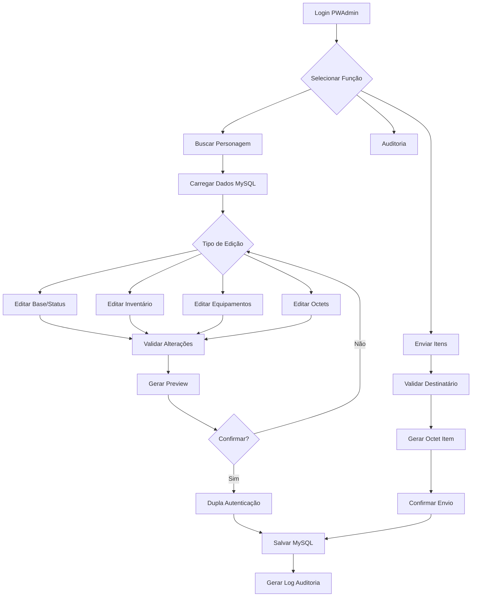

## 1. Visão Geral do Produto

PWAdmin é um sistema administrativo crítico para gerenciamento de personagens do MMORPG Perfect World. O sistema permite que Game Masters (GMs) editem dados de personagens diretamente no banco de dados MySQL/MariaDB, respeitando integralmente a estrutura binária oficial do jogo.

O produto resolve o problema de administração segura e eficiente de personagens, permitindo edição de status, inventário, equipamentos e envio de itens sem corromper dados. É destinado exclusivamente para administradores do jogo que precisam gerenciar personagens e resolver problemas de jogadores.

## 2. Funcionalidades Principais

### 2.1 Papéis de Usuário

| Papel | Método de Acesso | Permissões Principais |
|-------|------------------|----------------------|
| Game Master | Login com senha | Visualizar/editar personagens, enviar itens, gerar logs |
| Super Admin | Login com senha master | Todas as permissões + gerenciar GMs, acessar auditoria completa |
| Viewer | Login com senha | Apenas visualizar dados (sem edição) |

### 2.2 Módulos de Funcionalidades

O PWAdmin consiste nas seguintes páginas principais:

1. **Dashboard**: Visão geral do sistema, estatísticas rápidas, acessos recentes
2. **Busca de Personagens**: Localizar personagens por nome, ID, conta ou filtros avançados
3. **Editor de Personagem**: Editar dados base, status, localização e atributos
4. **Editor de Inventário**: Gerenciar itens no pocket (bolsa) do personagem
5. **Editor de Equipamentos**: Visualizar e modificar equipamentos usados
6. **Editor de Warehouse**: Gerenciar armazéns (store, dress, material, card)
7. **Editor de Octets**: Edição avançada de dados binários (armor, weapon, skills)
8. **Envio de Itens**: Enviar itens por correio interno do jogo
9. **Auditoria**: Visualizar histórico de alterações e logs de segurança
10. **Backup/Export**: Exportar dados de personagens para XML/binário

### 2.3 Detalhes das Páginas

| Nome da Página | Módulo | Descrição das Funcionalidades |
|----------------|---------|-------------------------------|
| Dashboard | Estatísticas | Mostrar total de personagens, últimas alterações, GMs online, alertas de segurança |
| Busca de Personagens | Formulário de busca | Buscar por nome exato ou parcial, ID numérico, nome da conta, filtro por level/classe/data |
| Editor de Personagem | Dados base | Editar name, race, class, gender, level, exp, sp, posição (x,y,z), worldtag |
| Editor de Personagem | Status | Modificar hp, mp, reputation, pk status, timers, property octets |
| Editor de Inventário | Lista de itens | Visualizar grid 6x8 (48 slots), adicionar/remover itens, editar quantidade/posição |
| Editor de Inventário | Item individual | Editar id do item, count, max_count, data octets, expire_date, guid1/guid2 |
| Editor de Equipamentos | Slots de equip | Visualizar 12 slots (head, body, weapon, etc), equipar/desequipar itens |
| Editor de Warehouse | Abas warehouse | Navegar entre store, dress, material, card com capacidades diferentes |
| Editor de Octets | Armor Editor | Visualizar e editar octets binários de armaduras com validação de tamanho |
| Editor de Octets | Weapon Editor | Editar octets de armas com campos de ataque, sockets, bonus info |
| Editor de Octets | Skills Editor | Gerenciar octets de habilidades com validação de estrutura |
| Envio de Itens | Formulário | Selecionar personagem destino, escolher item, quantidade, gerar data octet correta |
| Envio de Itens | Envio em massa | Upload CSV com múltiplos itens/personagens, validar capacidades antes de enviar |
| Auditoria | Log viewer | Filtrar por GM, personagem, data, tipo de alteração, ver antes/depois |
| Backup/Export | Export tools | Exportar personagem completo para XML ou binário, incluir todos os dados |

## 3. Fluxos Principais

### Fluxo de Edição de Personagem
1. GM faz login no sistema
2. Busca personagem por nome ou ID
3. Sistema carrega dados do banco MySQL
4. GM seleciona aba desejada (base, status, inventário, etc)
5. Sistema parseia octets binários para exibição amigável
6. GM faz alterações com validação em tempo real
7. Sistema gera preview das mudanças
8. GM confirma com dupla autenticação
9. Sistema salva no MySQL e gera log de auditoria

### Fluxo de Envio de Itens por Correio
1. GM acessa página "Enviar Itens"
2. Digite nome do personagem destino
3. Sistema valida existência e capacidade do destinatário
4. GM seleciona item do banco de dados ou digita ID
5. Sistema gera data octet correta para o item
6. GM define quantidade e parâmetros adicionais
7. Sistema valida requisitos (level, classe, etc)
8. GM confirma envio com senha de segurança
9. Sistema insere item no pocket do personagem
10. Gera log completo da transação

### Fluxo de Edição de Octets
1. GM acessa editor de octets (armor/weapon/skills)
2. Sistema carrega octet binário atual
3. Parseia octet respeitando estrutura exata
4. Exibe campos decodificados em interface
5. GM edita valores com validação de tipo/tamanho
6. Sistema reconstroi octet binário
7. Valida integridade antes de salvar
8. Gera backup automático do octet original
9. Salva novo octet no banco
10. Registra alteração na auditoria

## 4. Design da Interface

### 4.1 Estilo Visual
- **Cores principais**: Azul escuro (#1a2332) com detalhes em dourado (#f39c12)
- **Cores secundárias**: Cinza claro (#ecf0f1) para backgrounds, vermelho (#e74c3c) para alertas
- **Botões**: Estilo 3D com sombra, bordas arredondadas (border-radius: 4px)
- **Fontes**: Roboto para textos, monospace (Consolas) para octets/binários
- **Layout**: Baseado em cards com sombra suave, navegação lateral fixa
- **Ícones**: FontAwesome para consistência, evitar emojis em elementos críticos

### 4.2 Visão Geral das Páginas

| Página | Módulo | Elementos de UI |
|--------|---------|----------------|
| Dashboard | Cards de estatísticas | Cards retangulares com ícones grandes, números em fonte bold, gráficos de barras horizontais |
| Busca | Formulário | Input largo com placeholder, botão de busca azul, filtros em dropdown, tabela de resultados zebra-striped |
| Editor Personagem | Abas | Abas horizontais com ícones, formulários em grid 2 colunas, campos numéricos com spinner, validação em tempo real |
| Inventário | Grid 6x8 | Grid visual representando slots, drag-and-drop para mover itens, tooltip com detalhes ao hover, bordas coloridas por raridade |
| Octet Editor | Hex viewer | Editor hexadecimal lado a lado com decodificação, cores sintáticas para campos, validador de tamanho em tempo real |
| Envio Itens | Wizard | Interface em passos (1-2-3), progress bar, preview do item antes de enviar, caixa de confirmação modal |
| Auditoria | Tabela/log | Tabela expansível com detalhes, filtros múltiplos, paginação, export para CSV, cores por tipo de ação |

### 4.3 Responsividade
- **Desktop-first**: Otimizado para telas 1920x1080 (principal uso de GMs)
- **Mobile-adaptativo**: Funcional em tablets para acesso emergencial
- **Touch**: Suporte básico para interações touch, mas foco em mouse/keyboard

### 4.4 Considerações de Segurança
- Interface deve mostrar alertas visuais para ações destrutivas
- Campos sensíveis (senhas, octets) devem ter máscara opcional
- Logs de auditoria devem ser visualmente destacados
- Sistema de confirmação dupla com modais claros e informativos